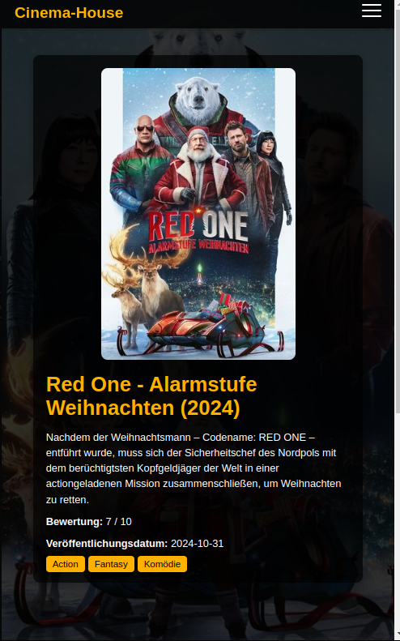

# Cinema-House

Cinema-House is a dynamic and responsive web application for browsing and exploring movies. The platform allows users to filter movies by popularity, release dates, genres, and ratings. It is built using HTML, CSS, and JavaScript, and leverages The Movie Database (TMDb) API for fetching movie data.

## Demo


**Live Demo:** [Cinema-House Live](https://orhanguezel.github.io/Cinema-House/)

---

## Features

- **Movie Search:** Search for movies by title.
- **Dynamic Filtering:** Filter movies by platforms, genres, release dates, and ratings.
- **Movie Details:** View detailed information about movies, including cast and genres.
- **Responsive Design:** Fully functional across desktop and mobile devices.
- **Localization:** The interface is available in German (Deutsch).

---

## Technologies Used

- **HTML5**
- **CSS3** (with responsive styling)
  - `movies.css`
  - `detail-navbar.css`
  - `detail-section.css`
  - `sidebar.css`
  - `footer.css`
  - `respons.css`
  - `search.css`
- **JavaScript**
  - `main.js`
  - `details.js`
  - `detail-navbar.js`
  - `navbar.js`
  - `movieApi.js`
- **Node.js** (for package management)

---

## Project Structure

```
Cinema-House/
├── css/
│   ├── detail-navbar.css
│   ├── detail-section.css
│   ├── footer.css
│   ├── movies.css
│   ├── respons.css
│   ├── search.css
│   ├── sidebar.css
│   └── style.css
├── js/
│   ├── detail-navbar.js
│   ├── details.js
│   ├── main.js
│   ├── movieApi.js
│   └── navbar.js
├── node_modules/
├── details.html
├── index.html
├── package-lock.json
├── package.json
├── README.md
└── demo-image.png
```

---

## Installation

1. Clone the repository:
   ```bash
   git clone https://github.com/Orhanguezel/Cinema-House.git
   ```

2. Navigate to the project directory:
   ```bash
   cd Cinema-House
   ```

3. Install dependencies:
   ```bash
   npm install
   ```

4. Open `index.html` in your browser or use a live server to view the project.

---

## Usage

- Navigate to the homepage to browse movies.
- Use the filters in the sidebar to refine your search.
- Click on a movie card to view detailed information, including its cast and genres.
- For mobile devices, the responsive design provides a hamburger menu for easy navigation.

---

## API Integration

This project uses **The Movie Database (TMDb) API** for fetching movie data. To run the project:

1. Create an account on [TMDb](https://www.themoviedb.org/).
2. Obtain your API key.
3. Replace the placeholder API key in `movieApi.js`:
   ```javascript
   this.apiKey = "your_api_key_here";
   ```

---

## Screenshots

### Homepage


### Homepage mobil


### Movie Details


### Movie Details mobil



---

## License

This project is licensed under the MIT License. See the [LICENSE](LICENSE) file for details.

---

## Acknowledgments

- [The Movie Database (TMDb)](https://www.themoviedb.org/) for the API.
- Icons by [FontAwesome](https://fontawesome.com/).

---

## Author

**Orhan**

Feel free to contact me for feedback or suggestions!
